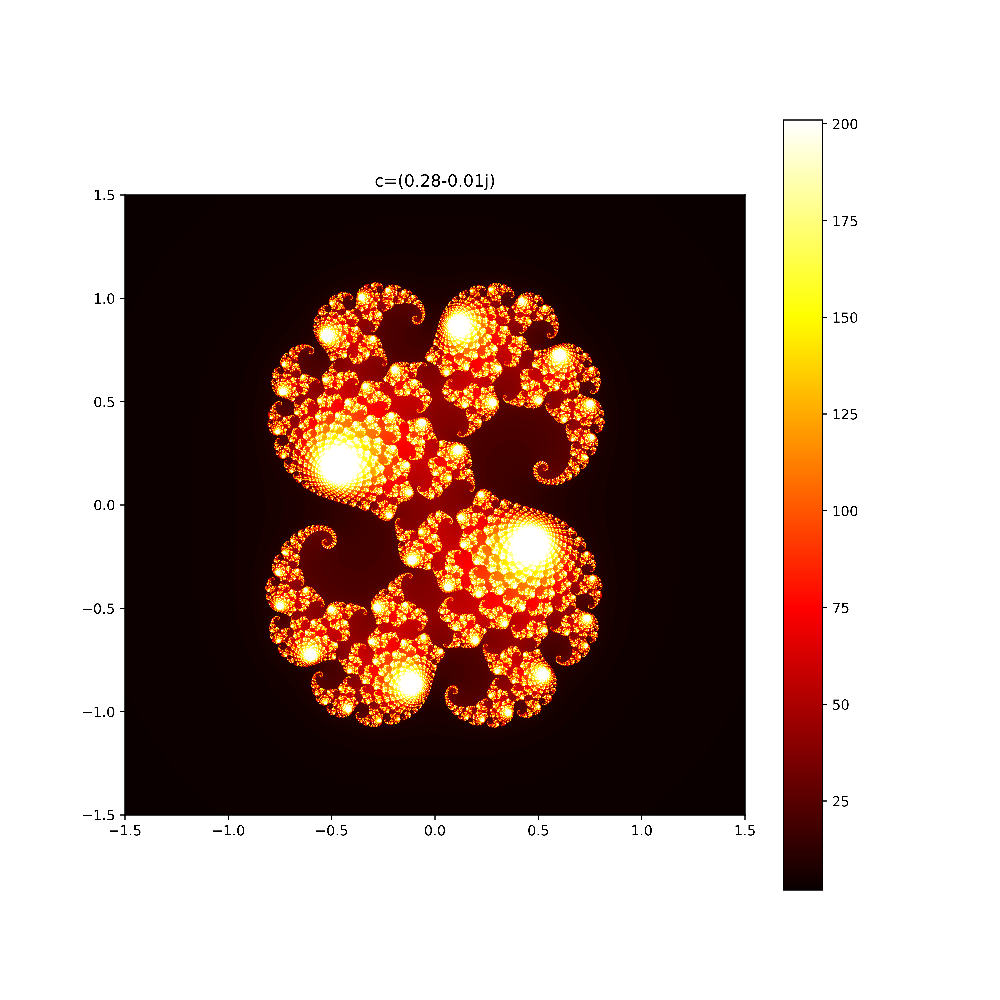

### 一些好看的结果展示： ###
julia集：  
</img>
</img>
</img>
</img>
mendelbrot集：  
</img>
</img>

**如果代码有问题或者有好的建议，欢迎联系QQ：2040319445 码字不易，转载请说明**

### 文件说明： ###
- 代码文件都在code文件夹里  
- korch_curve.py是雪花曲线，是通过迭代实时生成的，不能直接保存成图片，可直接运行
- julia.py是$a_{n+1}=a_n^2+c$当c取一固定值，$a_0$变化时由收敛点和发散点形成的图案。可直接运行，将在目录'./graph/julia图形'下生成图片
- 1.mendelbrot.py是$a_{n+1}=a_n^2+c$当$a_0$取一固定值0，然后c变化时，由收敛点和发散点形成的图案。可直接运行，将在目录'./graph/mendelbrot图形'下生成一张图片，分辨率由num变量设置  
  2.mendelbrot(一组).py可以生成一组代表不同放大倍数的图片并生成gif图片。可直接运行，同样将在目录'./graph/mendelbrot图形下生成一组图片和gif动图，分辨率由num变量设置    
  3.gif_generate.py是用图片生成gif图片的测试例子(不能直接运行)

### 运行环境说明： ###
- 本人python版本3.8.8
- 需要安装的库见各个文件

### 规范说明： ###
- min_value 表示 文件名和变量名
- getMinValue 表示函数名
- MinValue表示类名

### 总结： ###
- 对array维数的判断容易搞错
- imshow显示顺序：传入的矩阵显示元素的顺序，和正常坐标轴显示数据有所不同

```
原矩阵:ij表示(x[i],y[j])对应的发散速度(imshow显示默认也是按这个顺序的)
00 01 02 03 04...0n
10 11 12 13 14...1n
...
m0 m1 m2 m3 m4...mn

需要传入的矩阵：
0n 1n 2n ...mn
...
02 12 22 ...m2
01 11 21 ...m1
00 10 20 ...m0
(原矩阵逆时针旋转90°)
```
- imshow()里extent可以改变坐标映射，但图形显示不变
- python变量作用域:在main函数里定义的变量，在函数里也能访问，但在一个函数里定义的变量在其他函数里不能访问
- 类型提示：def f(a:int,b:float,c:List[str])->int:
- matplotlib好像不支持多线程绘图，可能因为多个线程共享plt,容易出现数据竞争，可以在线程里完成计算
- thread（跟java很像）:  
  1.t=Thread(fun,*args) t.start()  
  2.类继承Thread类，重写run方法，可以通过再写一个函数得到run返回结果  
- savefig函数里dpi是每英寸的像素点数量
- 图片的分辨率表示图片存储像素的多少（比特流），实际显示的物理分辨率不一定和这相等，操作系统或软件根据一定算法选择一些逻辑像素去计算对应物理像素，再显示出来
- imageio可以生成gif动图
